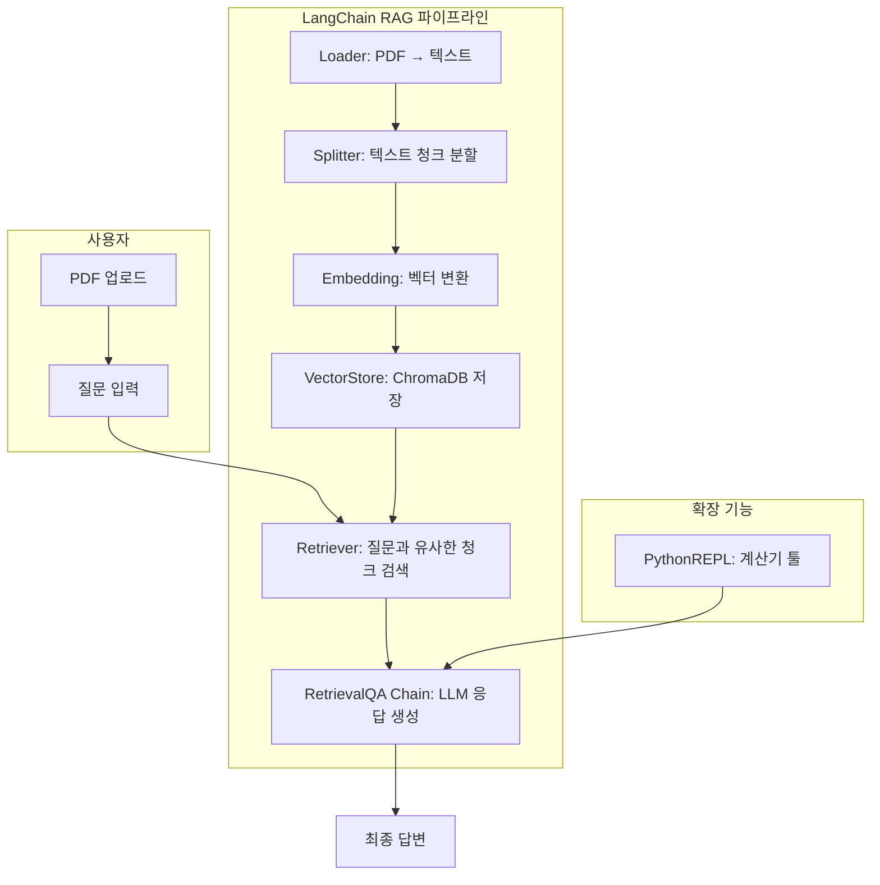

# LangChain · LangGraph · MCP : 재무제표 QA 챗봇에서 실무형 에이전트까지


- 목차
    1. **프로젝트 개요**
        - 목표
        - 전체 로드맵 (LangChain → LangGraph → MCP)
    2. **1단계: LangChain – 재무제표 QA 챗봇**
        - 목표
        - 아키텍처
        - 핵심 개념 (Loader, Splitter, Embedding, VectorStore, Retriever, QA Chain)
        - 코드 구조 & 실행 방법
        - 실습 결과 (QA 예시, 계산 예시)
        - 학습 포인트
    3. **2단계: LangGraph – 워크플로우 기반 확장**
        - 목표 (대화 상태 관리, 멀티스텝 Reasoning)
        - 아키텍처
        - LangChain 대비 LangGraph의 차별점
        - 코드 구조 & 실행 방법
        - 실습 결과 
        - 학습 포인트
    4. **3단계: MCP – 실무형 에이전트로 확장**
        - 목표 (멀티에이전트, 외부 API 연동)
        - 아키텍처
        - MCP의 핵심 개념 (Client, Tool, Protocol, Orchestration)
        - 코드 구조 & 실행 방법
        - 실습 결과 
        - 학습 포인트
    5. **종합 정리 및 실무 적용**
        - LangChain → LangGraph → MCP를 단계적으로 학습한 의미
        - 앞으로의 확장 아이디어 
    6. **폴더 구조**
        - 전체 프로젝트 구조 (`finance-qa-bot/`, `graph-extension/`, `mcp-agent/`)
    7. **설치 및 실행 방법**
        - Python 환경 (pyenv/venv)
        - requirements.txt / pip install
        - Streamlit 실행 방법
    8. **참고 자료**
        - LangChain 공식 문서
        - LangGraph 문서
        - MCP GitHub 레포지토리

# 1. 프로젝트 개요

## 목표

요즘 많은 기업에서 **사내 문서 검색 챗봇**, **업무 자동화 에이전트** 같은 프로젝트가 활발히 진행되고 있습니다. 

단순 질의응답을 넘어 내부 문서와 데이터에서 **검색 + 분석 + 계산**을 수행하고, 필요할 경우 외부 시스템(API, DB 등)과 연결할 수 있는 **실무형 AI 에이전트**에 대한 요구가 커지고 있습니다.

이때 주로 쓰이는 기술이 **LangChain, LangGraph, MCP**와 같은 LLM 오케스트레이션 프레임워크입니다.

- **왜?**
    - 단순히 LLM API만 호출하는 것과
    - 문서를 연결하고, 상태를 관리하고, 외부 시스템과 통신하는 것 사이에는 큰 차이가 있습니다.
- **어떻게?**
    - LangChain → 기본 RAG 챗봇 만들기
    - LangGraph → 대화형 워크플로우 확장
    - MCP → 외부 API 및 멀티에이전트 연동

즉, 이번 프로젝트는 단순히 LLM에 질문을 던지는 수준을 넘어, **문서 QA → 워크플로우 → 외부 연동 에이전트**로 발전시키는 **3단계 학습 로드맵**입니다.

---

## 로드맵 (LangChain → LangGraph → MCP)

- **LangChain – 기초 RAG 챗봇**
    - 문서 불러오기 (Loader)
    - 텍스트 분할 (Splitter)
    - 임베딩 및 벡터화 (Embedding + VectorStore)
    - 검색 (Retriever)
    - 답변 생성 (RetrievalQA)
    - 👉 결과: **문서 기반 QA 챗봇** 완성
    - 학습 포인트: **RAG(Retrieval-Augmented Generation)** 구조 이해, LLM + 외부 데이터 결합 기초
- **LangGraph – 워크플로우 확장**
    - LangChain만으로는 대화 상태 관리와 복잡한 Reasoning에 한계가 있음
    - LangGraph는 **State Machine / Graph 기반 오케스트레이션** 지원
        - 대화 맥락 유지
        - 단계적 Reasoning
        - 조건 분기 처리
    - 👉 결과: **단순 QA 챗봇 → 대화형 워크플로우 챗봇**으로 진화
- **MCP – 실무형 에이전트 확장**
    - 문서 QA + 대화형 챗봇만으로는 부족
    - 실무에서는 **외부 API, DB, 시스템 연동**이 필수
    - MCP(Model Context Protocol)는 LLM이 안전하고 표준화된 방식으로:
        - 외부 데이터 소스와 통신
        - 여러 에이전트 협업 가능
    - 👉 결과: **문서 QA → 워크플로우 → 외부 연동 에이전트**로 완성

---


# 2. 1단계: LangChain – 재무제표 QA 챗봇

---

## 1단계 목표

1단계의 목표는 **가장 기본적인 문서 기반 QA 챗봇**을 직접 구현해보는 것입니다.

- PDF 재무제표를 업로드하면, LLM이 문서 내용을 검색해서 답변
- 단순 검색을 넘어 “부채비율”, “자기자본비율” 같은 계산형 질문도 가능
- 웹 UI(Streamlit)를 통해 **문서 업로드 → 질문 입력 → 답변 확인** 플로우 완성

즉, 이 단계에서 학습할 핵심은 **RAG(Retrieval-Augmented Generation)** 구조입니다.

문서 전체를 LLM에 넣는 게 아니라 필요한 부분만 **검색해서 LLM에게 주입**하는 방식을 학습합니다.

---

## 아키텍처



1. **문서 업로드** → PDF 텍스트 추출
2. **텍스트 분할** → 작은 청크 단위로 나눔
3. **임베딩** → 텍스트 → 벡터 변환
4. **VectorStore 저장** → 빠른 검색 가능
5. **질문** → Retriever가 관련 청크 k개 검색
6. **LLM** → 검색 결과 기반 답변 생성
7. **PythonREPL** → 계산 요청 시 직접 연산

---

## 핵심 개념

### 1) Loader

- **역할**: PDF, 엑셀, 텍스트 파일을 읽어 텍스트로 변환
- 여기서는 `PyPDFLoader` 사용
- 예: “삼성전자 2022년 재무제표.pdf” → 텍스트 덩어리

---

### 2) Splitter

- **역할**: 긴 텍스트를 잘라 작은 단위(청크)로 분할
- 여기서는 `RecursiveCharacterTextSplitter` 사용
- 파라미터:
    - `chunk_size=500`
    - `chunk_overlap=50` (앞뒤 맥락 조금씩 겹치게)

---

### 3) Embedding

- **역할**: 텍스트 → 벡터(숫자 배열) 변환
- 여기서는 OpenAI의 `text-embedding-3-small` 사용
- “자산총계”와 “Total Assets”처럼 표현이 달라도 **유사한 벡터**로 변환됨

---

### 4) VectorStore

- **역할**: 벡터를 저장하고, 질문과 가장 가까운 청크 검색
- 여기서는 로컬 DB인 **Chroma** 사용
- 장점: 설치/운영이 간단하고 소규모 프로젝트에 적합

---

### 5) Retriever

- **역할**: 질문과 가장 유사한 청크 k개 반환
- 여기서는 `search_kwargs={"k":3}` 설정
- 예: “2022년 자산총계?” → 재무상태표 자산총계 부분 청크 3개 반환

---

### 6) QA Chain

- **역할**: (질문 + 검색 결과) → LLM → 답변
- 여기서는 `RetrievalQA` 사용
- Chain Type:
    - `stuff`: 단순히 검색 결과를 합쳐서 LLM에 전달
    - (추후 확장: `map_reduce`, `refine` 등도 가능)

---

## 📂 코드 구조 & 실행 방법

### 폴더 구조

```
finance-qa-bot/
├── app.py                # Streamlit 메인 실행 파일
├── requirements.txt      # 필요한 패키지
├── data/
│   ├── sample_report.pdf # 기본 제공 재무제표
│   └── uploaded.pdf      # 업로드 시 저장되는 문서
└── .chroma_db/           # 로컬 벡터DB 저장소
```

---

### requirements.txt

```
langchain==0.2.10
langchain-community==0.2.10
langchain-openai==0.1.8
langchain-experimental==0.0.62
chromadb==0.5.0
openai==1.35.7
tiktoken
pypdf
streamlit
python-dotenv
```

---

### 코드

```python
import os
from dotenv import load_dotenv
import streamlit as st

# LangChain & OpenAI 모듈
from langchain_community.document_loaders import PyPDFLoader
from langchain.text_splitter import RecursiveCharacterTextSplitter
from langchain_openai import OpenAIEmbeddings, OpenAI
from langchain_community.vectorstores import Chroma
from langchain.chains import RetrievalQA
from langchain.agents import initialize_agent, Tool
from langchain_experimental.tools import PythonREPLTool
# ----------------------------
# 0. 환경 변수 불러오기
# ----------------------------
load_dotenv()
OPENAI_API_KEY = os.getenv("OPENAI_API_KEY")

st.title("재무제표 QA + 계산기 챗봇")

# ----------------------------
# 1. 문서 준비 (업로드 or 기본 파일)
# ----------------------------
uploaded_file = st.file_uploader("재무제표 PDF 업로드", type="pdf")

# 업로드된 파일 사용
if uploaded_file is not None and "vectorstore" not in st.session_state:
    file_path = "data/uploaded.pdf"
    with open(file_path, "wb") as f:
        f.write(uploaded_file.getbuffer())
    st.success("문서 업로드 완료")

# 기본 문서 사용
elif uploaded_file is None and "vectorstore" not in st.session_state:
    file_path = "data/sample_report.pdf"
    if os.path.exists(file_path):
        st.info("업로드된 파일이 없어 기본 문서(sample_report.pdf)를 로드합니다.")
    else:
        st.warning("기본 문서가 없습니다. PDF를 업로드해주세요.")
        file_path = None
else:
    file_path = None

# ----------------------------
# 2. 최초 벡터스토어 생성 (1회만)
# ----------------------------
if file_path and "vectorstore" not in st.session_state:
    loader = PyPDFLoader(file_path)
    docs = loader.load()

    splitter = RecursiveCharacterTextSplitter(
        chunk_size=500,
        chunk_overlap=50
    )
    chunks = splitter.split_documents(docs)

    embeddings = OpenAIEmbeddings(model="text-embedding-3-small")
    vectorstore = Chroma.from_documents(
        chunks,
        embedding=embeddings,
        persist_directory=".chroma_db"
    )

    st.session_state.vectorstore = vectorstore

# ----------------------------
# 3. Agent (질문 시 실행)
# ----------------------------
if "vectorstore" in st.session_state:
    retriever = st.session_state.vectorstore.as_retriever(search_kwargs={"k": 3})
    llm = OpenAI(model="gpt-4o-mini", temperature=0)

    # RAG QA 체인
    qa_chain = RetrievalQA.from_chain_type(
        llm=llm,
        retriever=retriever,
        chain_type="stuff"
    )

    # Python 계산기 툴
    tools = [
        Tool(
            name="Financial QA Retriever",
            func=qa_chain.run,
            description="재무제표 관련 질문에 답변합니다."
        ),
        PythonREPLTool()  # 계산기 툴
    ]

    agent = initialize_agent(
        tools,
        llm,
        agent="zero-shot-react-description",
        verbose=True
    )

    query = st.text_input("질문을 입력하세요", "예시: 2022년 부채비율을 계산해줘.")

    if st.button("질문하기"):
        with st.spinner("분석 중..."):
            answer = agent.run(query)
            st.write("답변:", answer)
```

---

### 실행 방법

```bash
# 1. 설치
pip install -r requirements.txt

# 2. 환경변수 등록(.env)
OPENAI_API_KEY=api_key

# 3. 실행
streamlit run app.py
```

브라우저에서 `http://localhost:8501` 접속

---

## 결과


### (1) 기본 요약 질문

- 질문: `2022년과 2021년 자산총계의 변화를 요약해줘`
- 답변:
    
    > 2022년 자산총계는 91,414,977,715원이었고, 2021년은 89,558,636,311원이었습니다. 따라서 2022년 자산총계는 전년 대비 약 1,856,341,404원 증가했습니다.
    > 

---

### (2) 계산 질문


- 질문: `2022년 부채비율을 계산해줘`
- 과정: Retriever가 **부채총계**와 **자본총계** 값을 검색 → PythonREPLTool로 계산 → LLM이 응답
- 답변:
    
    > 90.83% (2022년 부채비율)
    > 

---

### 질문 유형별 답변 전체
  <details>
    
    ### 1. 기본 요약
    
    1. 2022년과 2021년 자산총계의 변화를 요약해줘.
        
        답변: 2022년 자산총계는 91,414,977,715원이었고, 2021년 자산총계는 89,558,636,311원이었습니다. 따라서 2022년 자산총계는 2021년보다 1,856,341,404원이 증가했습니다.
        
    2. 2022년 부채총계와 자본총계는 각각 얼마이며, 전년과 비교했을 때 어떤 변화가 있었는지 알려줘.
        
        답변: 2022년 부채총계는 8,380,242,857원이며, 자본총계는 83,034,734,858원입니다. 전년과 비교했을 때 부채총계는 감소하였고, 자본총계는 증가하였습니다. 부채총계는 2021년 8,637,777,122원에서 8,380,242,857원으로 감소하였고, 자본총계는 2021년 80,920,859,189원에서 83,034,734,858원으로 증가하였습니다.
        
    3. 재무상태표 전체를 간단히 요약해줘.
        
        답변: 재무상태표는 2022년 12월 31일 기준으로 작성되었으며, 자산 총계는 83,034,734,858원, 부채 총계는 8,380,242,857원, 자본 총계는 74,654,492,001원입니다. 자본금은 20,000,000,000원이며, 이익잉여금은 61,797,554,711원입니다. 기타포괄손익누계액은 1,237,180,147원입니다. 전체 부채 및 자본 총계는 91,414,977,715원입니다. 
        
    
    ### 2. 세부 항목 분석
    
    1. 2022년 유동자산과 비유동자산의 규모와 주요 항목을 요약해줘.
        
        답변: 2022년 유동자산의 규모는 59,312,333,699원이며, 주요 항목으로는 현금및현금성자산(3,508,584,512원), 단기금융상품(6,368,365,000원), 단기투자자산(9,944,725,598원), 매출채권(31,288,847,347원) 등이 있다. 비유동자산의 규모는 32,102,644,016원이며, 주요 항목으로는 투자자산(21,675,493,422원), 유형자산(8,634,157,894원), 기타비유동자산(1,792,992,700원) 등이 있다.
        
    2. 2022년 유동부채 구성 항목 중 가장 큰 항목은 무엇인지 알려줘.
        
        답변: 2022년 유동부채 구성 항목 중 가장 큰 항목은 미지급비용입니다. (금액: 2,533,224,946원)
        
    3. 2021년 대비 2022년에 증가한 주요 자산 항목은 무엇인가?
        
        답변: 2021년 대비 2022년에 증가한 주요 자산 항목은 매출채권입니다. 2021년에는 16,579,937,265원이었으나 2022년에는 31,288,847,347원으로 증가하였습니다. 이는 약 14,708,910,082원의 증가를 나타냅니다. 다른 자산 항목들도 증가했지만, 매출채권의 증가가 가장 두드러진 항목입니다.
        
    
    ### 3. 계산 문제
    
    1. 2022년 부채비율(부채총계 ÷ 자본총계 × 100)을 계산해줘.
        
        답변: 2022년 부채총계는 8,380,242,857원, 자본총계는 83,034,734,858원입니다. 따라서 부채비율은 약 10.1%입니다.
        
    
    ### 4. 통합 인사이트
    
    1. 2022년 재무상태표를 보면, 회사의 재무 건전성 측면에서 어떤 특징이 있는지 설명해줘.
        
        답변: 2022년 재무상태표를 보면, 서울청과주식회사의 유동자산은 59,312,333,699원으로, 비유동자산인 32,102,644,016원보다 훨씬 높은 수치를 기록하고 있습니다. 이는 회사가 단기적인 재무 의무를 이행할 수 있는 능력이 높다는 것을 나타내며, 유동성 측면에서 긍정적인 신호입니다. 또한, 매출채권이 31,288,847,347원으로 상당히 높은 비중을 차지하고 있어, 회사의 매출이 안정적임을 시사합니다. 그러나 현금및현금성자산이 3,508,584,512원으로 감소한 점은 유의해야 할 사항입니다. 전반적으로, 유동자산이 비유동자산보다 많고 매출채권이 높은 비중을 차지하고 있어 재무 건전성이 양호하다고 볼 수 있습니다. 하지만 현금 유동성의 감소는 주의가 필요합니다.
        
    2. 유동성과 수익성을 고려했을 때 어떤 리스크 요인이 있을까?
        
        답변: 유동성과 수익성을 고려할 때, 다음과 같은 리스크 요인이 있을 수 있습니다:
        
        1. **유동성 리스크**: 유동자산이 유동부채보다 적거나 비율이 낮을 경우, 단기적인 채무 이행에 어려움이 발생할 수 있습니다. 예를 들어, 서울청과주식회사의 경우 유동부채가 4,910,167,999원으로 유동자산 59,312,333,699원에 비해 상대적으로 낮아 보이지만, 유동자산의 구성 요소 중 현금 및 현금성 자산이 감소하고 있는 점은 유동성 리스크를 증가시킬 수 있습니다.
        2. **수익성 리스크**: 수익성이 낮거나 감소하는 경우, 기업의 지속적인 운영에 부정적인 영향을 미칠 수 있습니다. 예를 들어, 매출채권이 증가하고 있지만 대손충당금도 증가하고 있는 점은 수익성에 대한 리스크를 나타낼 수 있습니다. 이는 고객의 지급능력에 문제가 있을 수 있음을 시사합니다.
    3. 회사의 재무 구조 개선을 위해 어떤 포인트를 강화해야 하는지 제안해줘.
        
        답변: 회사의 재무 구조 개선을 위해 다음과 같은 포인트를 강화할 수 있습니다:
        
        1. **유동자산 관리**: 유동자산이 증가하고 있지만, 현금 및 현금성 자산이 감소하고 있습니다. 현금 흐름을 개선하기 위해 매출채권 회수 기간을 단축하고, 재고 관리를 효율적으로 하여 유동성을 높이는 것이 중요합니다.
        2. **부채 관리**: 부채 비율을 낮추기 위해 장기적인 부채 상환 계획을 수립하고, 필요시 자본 조달 방안을 모색해야 합니다.
        3. **비용 절감**: 운영 비용을 절감할 수 있는 방안을 모색하여 이익률을 개선하고, 이를 통해 재무 구조를 강화할 수 있습니다.
  </details>

---

## 중요 포인트

- 단순 LLM 호출이 아니라, **문서 → 청크 → 임베딩 → 검색 → QA**로 이어지는 RAG 구조
- Retriever의 성능이 곧 답변 품질로 이어짐
- PythonREPL 같은 **계산 전용 툴**을 붙여서, 재무 비율 계산처럼 **정확한 수치 연산이 필요한 질문도 안정적으로 처리**할 수 있게 만듦
- Streamlit을 사용해 **별도의 프론트엔드 개발 없이도 웹 인터페이스**를 빠르게 구성

---

→ 여기까지가 1단계, 즉 **LangChain만으로 문서 기반 QA 챗봇을 만드는 과정**입니다.

2단계에서는 LangGraph를 이용해 **대화 맥락 유지 + 워크플로우 제어**를 확장할 예정입니다.

---
